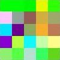

# NaturalADV: An Exploratory Framework to Balance Adversarial Strength and Stealth in Autonomous Driving Environments

  
  
  
  
  
   

This repository contains instructions and source code for using the NaturalADV framework to balance naturalness and adversarial strength for pre-generated adversarial perturbations.
It contains instructions to install, troubleshoot, and initialize the NaturalADV framework and how to incorporate new differentiable image similarity metrics.

## Quick Links

AAAI'25 poster: [PDF version](https://missmeriel.github.io/files/posters/AAAI2025-DATASAFE-naturaladv-poster.pdf)

## NaturalADV Generation Framework

  

  

